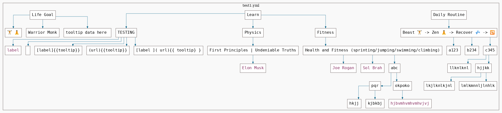

# yml2dot

[](https://creativecommons.org/licenses/by-sa/4.0/)

This tool parses a nested YAML file into a dotgraph and renders it to a PNG image. It can be used for visualizing any nested YAML content, like `todo` lists, `config` files, etc. I use it as part of a CTF/Pentest writeups automation framework, [svachal](https://github.com/7h3rAm/svachal).

Usage:
```console
$ python3 ./yml2dot.py -h
usage: yml2dot.py [-h] -y YAML [-r] [-l] [-c] [-d]

yml2dot (v0.1)

optional arguments:
  -h, --help            show this help message and exit
  -y YAML, --yaml YAML  yaml file to visualize
  -r, --addrootnode     add a root node to dotgraph
  -l, --rankdirlr       use left to right direction for child nodes
  -c, --randomnodecolor
                        use random colors for nodes
  -d, --d3dot           create a d3 html of dotgraph
```

Here's a sample YAML for reference:

```yaml
$ cat test1.yml

Daily Routine:
  Beast 🏋 -> Zen 🧘 -> Recover 💤 -> 🔁:
    a123:
    b234:
    c345:
      - llknlknl
      - hjjkk:
          - lkjlknlkjnl
          - lmlkmnnljlnhlk:
              - 
Life Goal:
  - 🏋 🧘
  - Warrior Monk
  - "    {{ tooltip data here }}"
Learn:
  TESTING:
    - "[label](url){{tooltip}}"
    - "[](url){{tooltip}}"
    - "[label]{{tooltip}}"
    - "(url){{tooltip}}"
    - "[label ]( url){{ tooltip} }  "
  Physics:
    "First Principles | Undeniable Truths":
      - "[Elon Musk](https://twitter.com/elonmusk)"
  Fitness:
    Health and Fitness (sprinting/jumping/swimming/climbing):
      - "[Joe Rogan](https://twitter.com/joerogan)"
      - "[Sol Brah](https://twitter.com/solbrah)"
      - abc:
          pqr:
            - hkjj
            - kjbkbj
          okpoko: |
            [hjbvmhvmhvmhvjvj](nkjn;n;knklnlj)
``` 

Here's the commandline to visualize this file:
```console
$ python3 ./yml2dot.py -rcy test1.yml
```

Here's the visualized image for this file:


Here are a few more images for reference:


